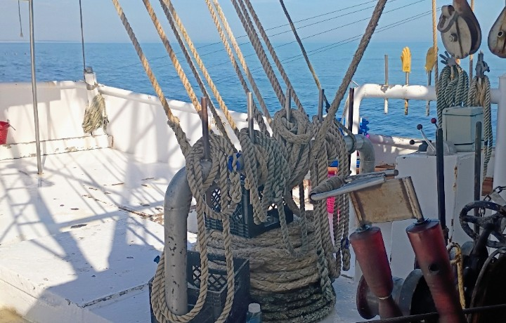
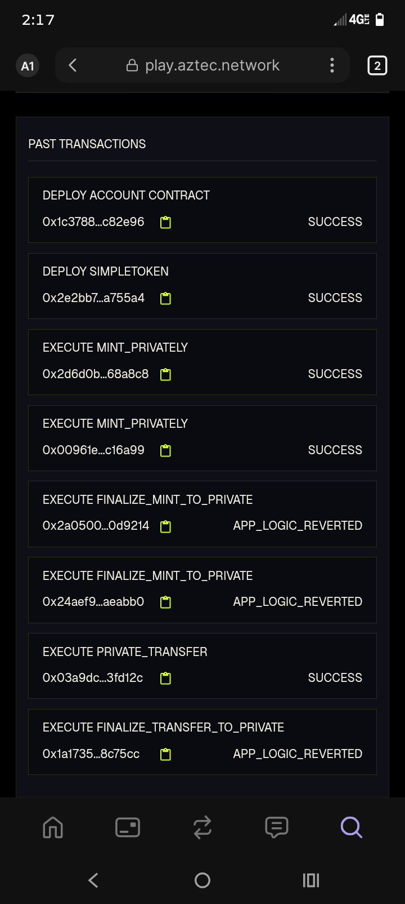

  

🚢 StationaryDev37: Aztec 30-Day Challenge
Day 1: Maiden Voyage
Goal: Bridge from commercial shrimping to ZK development.
Achievement: Created professional GitHub repo & executed first private transfer on Aztec Playground.
Proof: 5 $AZTEC-test sent to vault.
---
### 🛠️ Day 2: Advanced Private Execution Success
**Technical Achievement:** Successfully navigated the Aztec Playground to perform core privacy functions.
* **Confidential Minting:** Executed `MINT_PRIVATELY` twice with a "SUCCESS" status.
* **Private Transfer:** Successfully moved assets via `PRIVATE_TRANSFER` on-chain.
* **Infrastructure:** Successfully deployed both the **Account Contract** and the **SimpleToken** contract.

**Visual Evidence of Chain Success:**

